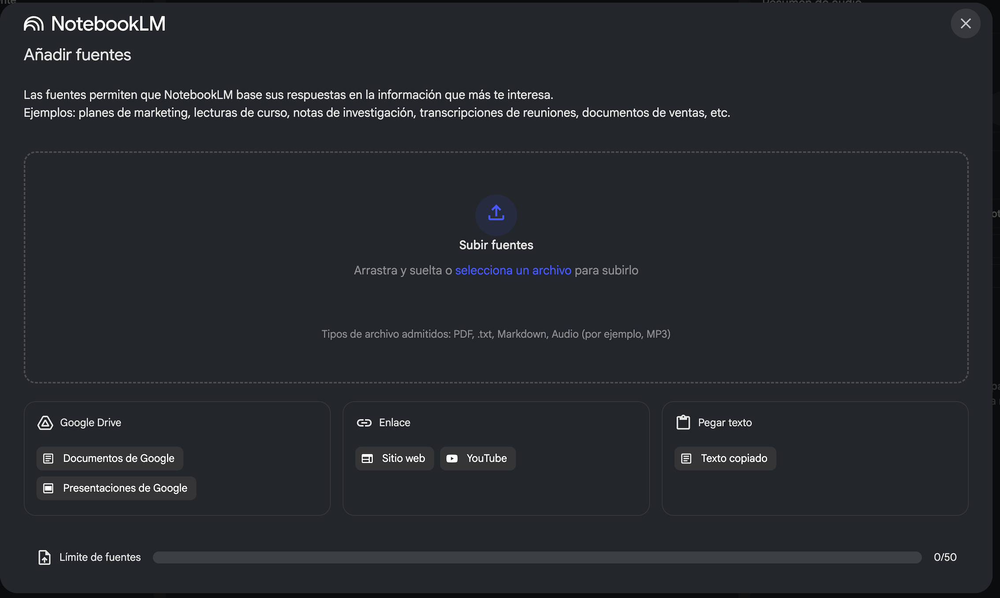
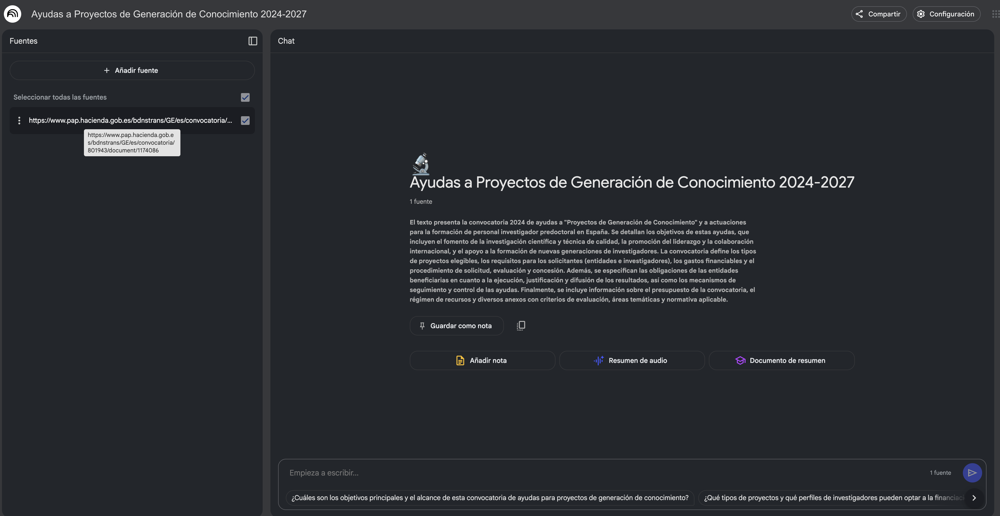
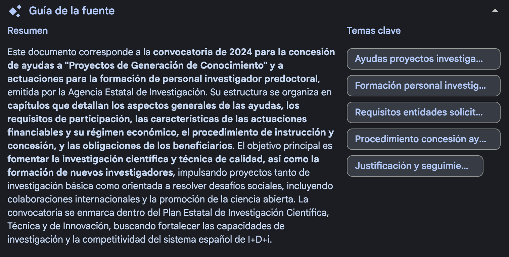

----

marp: true

----

# Fuentes

Cada notebook tiene sus propias fuentes, **NotebookLM** actualmente soporta:
- Google Docs
- Google Slides
- Archivos PDF, Texto y Markdown
- URLs web
- Texto copiado y pegado
- URLs de YouTube (videos públicos)
- Archivos de audio

-----

# Fuentes

**Limitaciones generales:**
- Cada fuente puede contener hasta 500,000 palabras o hasta 200MB para archivos cargados
- **Google Docs/Slides**: NotebookLM crea una copia estática. Los cambios en el documento original requieren sincronización manual con el botón "Click to sync with Drive".
- **PDFs**: A partir de septiembre 2024, se soportarán PDFs que contienen solo imágenes. La carga de PDFs a través de Drive no está soportada actualmente. Si tenemos un error al incorporar un fichero pdf se debe verificar la calidad del mismo
- **URLs web**: Solo se extrae el contenido de texto visible. No se importan imágenes, videos o páginas anidadas. No funciona con páginas con paywall o que hayan deshabilitado el web scraping.

---

## Añadir fuentes 

- Google drive (documentos y presentaciones)
- Enlaces (sitios web y vídeos)
- Pegar texto

---

## Añadir fuentes 

Insertamos la url del documento

https://www.pap.hacienda.gob.es/bdnstrans/GE/es/convocatoria/801943/document/1174086

---

## Añadir fuentes 

El notebook tiene titulo y un texto de resumen

---

## Añadir fuentes 

- La fuente ya esta incorporada al notebook
- Ha sido transformada a texto.
- Aparece un resumen y un índice de temas clave
- Se puede ver el detalle de cualquiera de los temas clave